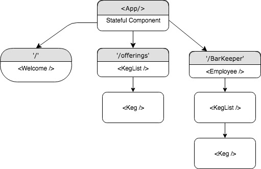

# HopShop

A Web App, created with React, that I previously made with Angular to compare and contrast.
* Differences: React is very free which created more time of thinking how the project should be structured. Angular provided that structure so I could spend more time actually building out the application.

## Created
Epicodus Independent Project 
Austin Barr

## Installation
(if you do not have node)

```
brew install node
```
```
node -v
v6.2.0
```
```
npm -v
3.10.5
```

1. Clone this repository.


 ```
NPM Install
 ```


2. Run App on local server
  ```
  NPM RUN Start
  ```
3. Navigate to http://localhost:8080/#/ in browser.    
## Specifications
1. App will have an employee facing side.
2. App will have an customer facing side.
3. App will display a hard coded list of beers.
4. App will allow an employee to add beers to list.


### Technologies Used

* React
* JS
* HTML
* CSS
* BOOTSTRAP

### Support and Contact Details
If you encounter any bugs or would like to make suggestions regarding this project, please feel free to contact austinbarr@protonmail.com.

### Notes
Planning this project was very time consuming. I was happy I only had one stateful component. I am still getting used to React and believe I just need a good chunk of time to really understand best practices of structuring a React app.

### Component Structure



### License

This project is distributed under the MIT License
